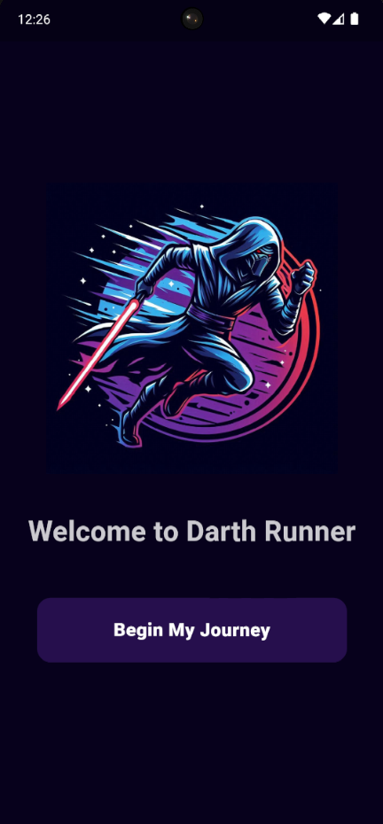

# Darth Runner

Darth Runner is an Android fitness mobile application that offers a fun, simple, and user-friendly interface for consistently monitoring running progress. Quickly track distance and time ran. Set weekly goals to stay motivated and check your BMI score with an inbuilt BMI calculator. Join social groups for encouragement and access to recommended diets and training plans to achieve specific fitness goals. Earn cute badges as you complete various achievements! 

  

## Installation

- Install the [APK file](https://drive.google.com/file/d/1IY_jDTiTzuEF7ks27Cs98D0st02rmCSl/view?usp=sharing) onto your Android device.
- Allow necessary permissions and security scans if needed.
- Sign up and enjoy the features of Darth Runner!

    
## Features

- User Authentication and Onboarding Pages
- Distance Tracker
- Calendar
- BMI Calculator
- Social Groups and Interactions
- Recommendations on Training and Diet Plans
- Badges and Achievements

## Demo

  <video controls src="assets/video/demo.mp4" title="Demo"></video>

## Authors

- [@Bonzzz3](https://www.github.com/Bonzzz3)
- [@Cjoshd](https://github.com/Cjoshd)

